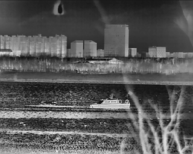
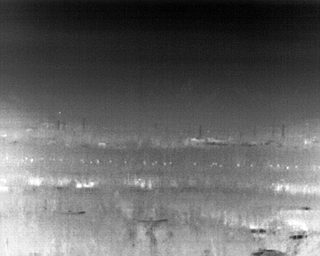
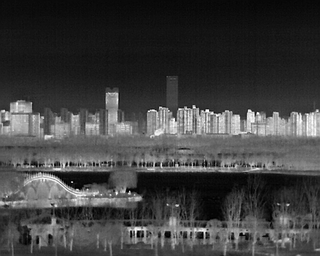
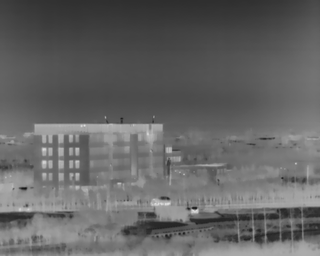
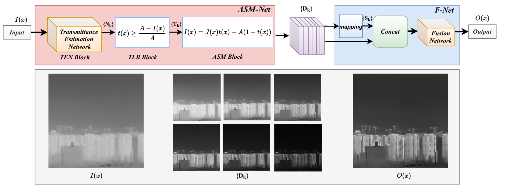

# ASMF: A Self-Supervised Atmospheric Scatter Model-Based Fusion Network for Infrared Image Enhancement

# Overview

This repository provides two key products:

1. **LGC Dataset**
2. **The Algorithm** proposed in the paper *"ASMF Self-supervised Fusion Network for Infrared Image Enhancement"*

# LGC Dataset

## introduction 

LGC Dataset is captured by IRay Tech's LGC6122 uncooled LWIR infrared core. Its most significant advantage is its 72 mm focal length, which enables long-distance detection. For example, it facilitates the detection of human subjects at distances of up to 1.3 kilometers and vehicles at distances of 1.7 kilometers. For detailed information about the LGC6122 infrared camera, please refer to the "LGC6122非制冷红外机芯组件产品说明书", which is written in Chinese. 

This dataset is made for validation and development of infrared image enhancement algorithms

<p align="center">
  
  
  
  
</p>

## Data access

1. **Baidu Cloud**

   [Access link](https://pan.baidu.com/s/1Rq2uzbcemVISyRiPYxU1zw?pwd=wy3f)  
   Password: wy3f

2. **Google Drive**

   [Access link](https://drive.google.com/drive/folders/1aOSpS7xUofiGAh2OjRe_uCcUeaTcwppb?usp=drive_link)

# ASMF: A Self-Supervised Atmospheric Scatter Model-Based Fusion Network for Infrared Image Enhancement 
## Description
This work presents an atmospheric scattering model-based infrared image enhancement algorithm, which can also be regarded as an infrared image dehazing method. The algorithm is implemented in a self-supervised manner and demonstrates superior performance across several large-scale public datasets. Notably, the training process requires only a few hundred images, making it both efficient and data-friendly.
Furthermore, it is a lightweight network capable of achieving real-time performance on hardware platforms. The core architecture and enhancement results of our method are illustrated below:

<p align="center">
  
</p>

## Requirements

1. Python 3.8
2. Pytorch 2.0.0
3. cuda 11.8

<!-- To run the quick test, use the following command:

<!-- ```bash
python test.py --name="experiment_name" --Dataset="dataset_name"
``` -->

## Quick Test

You can directly use our pre-trained weights to evaluate the performance of our algorithm, which takes only a short time.

To perform a quick test, first download the folder "data" from one of the following sources:

1. **Baidu Cloud**

[Access link](https://pan.baidu.com/s/1-7OpJ9Ku8JXGb4MJziZdVQ?pwd=9auj)  
Password: 9auj

2. **Google Drive**

[Access link](https://drive.google.com/drive/folders/1YyNn-vCOCs21wkAt42uC8W52glkNmQgo?usp=sharing)

After downloading, replace the default "data" folder in your project with the one you just downloaded

Then, run the following command:
```bash
python test.py --name=LGC_std --Dataset=LGC
```

The output images will be saved in the "LGC_std" folder for you to view the results.

## Enhance Images

## Preparation
Follow these steps to use your own dataset:

1. **Split your dataset** into training and testing data.

2. **Select several images** from the training data to serve as check data, which you can check during training.

3. **Organize your dataset**:
   - Place the training data into `./data/train_data/datasetname`
   - Place the testing data into `./data/test_data/datasetname`
   - Place the check data into `./data/check_data/datasetname`

   Here, `"datasetname"` refers to the name of your dataset.

## Train
If you choose "your_experiment_name" as the name of your experiment, use the following command to start training:
```bash
python train.py --name="your_experiment_name" --Dataset="datasetname"
```

## Test
Once training is completed, use the following command to generate the final enhanced images:

```bash
python test.py --name="your_experiment_name" --Dataset="datasetname"
```

Intermediate data (such as training-related images) saved in the "experiment" folder can be deleted to save disk space. The final enhanced results will be saved in the "your_experiment_name" folder.

# At Last

If you meet any problem while using my work, be free to contact my email: andy_lly@163.com. 

